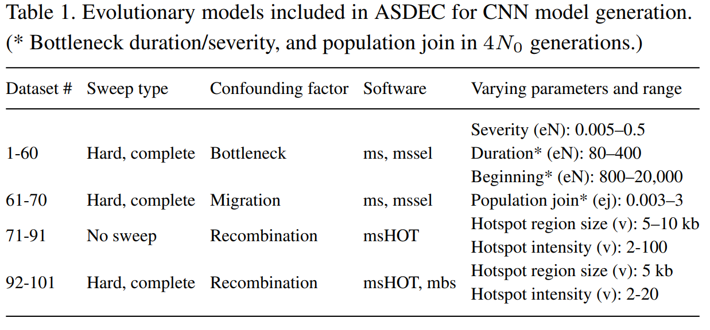

# ASDEC: Genome-wide Detection of Positive Selection using Convolutional Neural Networks
===============================================

Authors: Matthijs Souilljee (souilljee@live.nl) and Nikolaos Alachiotis (n.alachiotis@gmail.com)

First release: 31/07/2021

Last update: 23/09/2021

Version: 1.1

# ABOUT
-----

ASDEC (Accurate Sweep Detection Enabled by a CNN) is a stand-alone software implementation of a Convolutional Neural Network (CNN) for sweep detection.

The current ASDEC release can process SNP data in Hudson's ms, VCF (Variant Call Format) file formats or FASTA using [RAiSD](https://github.com/pephco/RAiSD/) for parsing to vcf first. The given basic run example is in Hudson's ms format. For the VCF format, refer to the respective Wikipedia entry (https://en.wikipedia.org/wiki/Variant_Call_Format).

Concerning the handling strategy of missing data the same strategy as deployed by [RAiSD](https://github.com/pephco/RAiSD/) is used. 

# Supported file formats
-----

ASDEC implements the following coalescent simulation software: ms, mssel, mbs (chromosome length always normalized by division with 100000), and msHOT. The vcf format is parsed by ASDEC using a specific implementation of [RAiSD](https://github.com/pephco/RAiSD/) (no manual parsing required, ASDEC handles vcf), and the FASTA format can be used by first parsing to vcf using [RAiSD](https://github.com/pephco/RAiSD/) and then providing the vcf file to ASDEC. ASDEC also implements various coalescent simulations out of the box see the table for more information. 



# Download and Setup
--------------------

To obtain ASDEC Use `git clone` to start using the repo locally. The software was written and tested using Ubuntu 20.04.1 LTS and Python 3.8.10. 

After cloning the repository please give the repo the corresponding rights by running:
```bash
chmod -R +x ASDEC/
```
Now you can enter the repo.
```bash
cd ASDEC/
```

### Installation dependencies
Use the package manager to install [tensorflow](https://www.tensorflow.org/), [keras](https://keras.io/), and following the install instructions of TensorFlow 2 and Keras. Besides python3 also python3-dev and python3-venv should be installed on the machine. Different bash files are used for automation tested version: GNU bash, version 5.0.17(1)-release (x86_64-pc-linux-gnu).
Install the following pip packages for python3 may require pip3 instead of pip:
```bash
pip3 install tensorflow==2.4.1
pip3 install keras==2.4.3
pip3 install numpy==1.19.5
pip3 install h5py==2.10.0
pip3 install matplotlib==3.4.1
pip3 install tensorboard==2.4.1
pip3 install pillow==7.0.0
```
Optional pip packages:
```bash
pip3 install tensorboard-plugin-profile==2.4.0
```

### Trajectory files
If the usage of the automatic data generation is desired, please follow to steps underneath.
To get the trajectory files run the included bash script from the root of the repo:
```bash
./tools/setupTrajectoryFiles.sh
```

### VCF file parsing
For the VCF parsing a subset of the tool [RAiSD](https://github.com/pephco/RAiSD/) is used therefore to use the vcf parser the [GNU Scientific Library (GSL)](https://www.gnu.org/software/gsl/) needs to be installed. Otherwise, the following error can be observed.

	Error message:
	./RAiSD_Parser/RAiSD: error while loading shared libraries: libgsl.so.23: cannot open shared object file: No such file or directory
	rm: cannot remove 'RAiSD_Info.test_run': No such file or directory
	rm: cannot remove 'RAiSD_Report.test_run': No such file or directory

	------STARTED RUNNING test_input.vcf.ms------

	Traceback (most recent call last):
	  File "src/LoadCNN.py", line 555, in <module>
	    main(sys.argv[1:])
	  File "src/LoadCNN.py", line 416, in main
	    openfile = open(filesFound, 'r')
	FileNotFoundError: [Errno 2] No such file or directory: '/home/sweepcnn/Downloads/test_input.vcf.ms'

### Basic test
After the previous steps check the setup by running the following commands from the root of the repo (always run from the root of the repo to avoid potential problems).
```bash
python3 src/TrainCNN.py -h
```
This should give you a list of all possible options for the program. Next, run the following command (again from the root of the repo):
```bash
python3 src/LoadCNN.py -h
```
This again should give a list with all possible options. If a package is missing please install it and when any script gives problems or are not able the run, please make them executable by running:
```bash
chmod +x src/scripts/*.sh
```

# Basic example train model and perform inference
--------------------
Go to the root of the ASDEC repository.
Create a folder to save your TensorFlow 2 model.
```bash
mkdir models/
```
Also, create a folder to save our ASDEC results after inference.
```bash
mkdir archive/
```
### Training
Go to the root of the ASDEC repository.
Let us train a model based on the bottleneck data-sets 1-10 using TrainCNN.py, run the following command to see all the options:
```bash
python3 src/TrainCNN.py -h
```
Only the parameters that differ should be added otherwise the def value is taken.
```bash
python3 src/TrainCNN.py -a 1 -b 10 -c 1 -d 10 -e 10 -p models/TESTMODEL -o 3 --CPU
```
Here we start with data-set 1 till and including 10 for both ms and mssel (given by the values of parameters: a, b, c, and d).
Next, we use -e to tell ASDEC to create 10 populations per file -p gives us the location and name of the model, and lastly -o gives us the number of training epochs.
All other parameters can be left to their default value including -q which now uses the SweepNet CNN design/architecture.
Check out the 'models/TESTMODEL' directory for your model.

**output:** 
```bash 
The output file TrainResultsAcc.txt: epoch number, training accuracy, validation accuracy 
```
```bash 
The output file TrainResultsLoss.txt: epoch number, training loss, validation loss  
```
The other output files are self-explanatory  

### Inference
Go to the root of the ASDEC repository.
Important if for any reason you would like to kill ASDEC performing inference please see the instructions given further down in the readme to do this correctly.
Let us perform inference with our trained SweepNet model.
```bash
python3 src/LoadCNN.py -h
```
Only the parameters that differ should be added otherwise the def value is taken.
```bash
python3 src/LoadCNN.py -a 1 -b 1 -c 1 -d 1 -e 2 -p archive/ -x archive/preLog/ -o archive/postLog/ -n models/TESTMODEL -t 2 -v 1 -u true --search --CPU
```
Here we perform inference on data-set 1 with a model trained with data-set 1-10.
Here the parameters -a,-b,-c,-d, and e have the same meaning as during training.
Now the -o is for saving the post-processed files (postLog folder is created automatically), -p is for saving the summary-file (needed for distance error, success rate, and TPR calculations), and lastly, the -x parameter is savin the files before post-processing (preLog folder is created automatically).
The -t flag gives the number of threads being used by the ASDEC inference software, -u is the cleaning of the temp folders used by ASDEC, and the search flag is required because we are using search mode which includes data generation, and extra logging such as the -p and -x flag. Lastly the -v flag gives the number of populations to process per thread.

The execution can take up some time, when done check the archive folder for the results.

**output:** 
```bash
The preLog files: image starting position, image end position, average image position, probability neutrality, probability selection
```
```bash
The postLog files: entry starting position, entry end position, average entry position, probability neutrality, probability selection, number of points used in averaging
```
for the summary file, the entry with the highest probability of selection is taken of every postLog file.  
```bash
The summary files: entry starting position, entry end position, average entry position, probability neutrality, probability selection, number of points per average    
```
The other files in the info folder are self-explanatory.  
## Get metrics success rate, distance error, and TPR
Go to the root of the ASDEC repository.
Lastly to calculate the success rate, distance error:
```bash
python3 tools/accuracy.py -i archive/logTraj_TEST1_summary.txt -c 500000 -r 10000 -o archive/results/acc.txt -f false -p 0
```
For more information run:
```bash
python3 tools/accuracy.py -h
```
**output:** 
```bash
the accuracy files: Path to file to score, raw distance, amount of entries correct, the total amount of entries, percentage of correct entries (success rate), raw distance  
```
And to calculate the TPR with a given 5% FPR value:
```bash
python3 tools/TPRFPR.py -n archive/logTraj_BASE1_summary.txt -s archive/logTraj_TEST1_summary.txt -f 0.05 -o archive/results/tprfpr.txt -r false -d false
```
For more information run:
```bash
python3 tools/TPRFPR.py -h
```
**output:**  
```bash
the TPR files: Path to file to score: the value of neutral data-set at given FPR value, given FPR, calculated TPR  
```
These results are probably not usable, but give a simple introduction into how to use ASDEC.

# Important killing ASDEC Inference!
--------------------
When ASDEC needs to be killed during execution please follow these steps in the specified order.
When no PID is returned ASDEC already closed the process, this is fine just continue to the next one.
```bash
pgrep -f modelRun.sh
```
kill all returned PIDs
```bash
pgrep -f pipelineLoad.sh
```
kill all returned PIDs
```bash
pgrep -f generateLoad.sh
```
kill all returned PIDs
```bash
pgrep -f python3
```
kill all returned PIDs (if other python3 processes are running please only select the ASDEC ones)

# Using custom input ms/vcf format files
--------------------
When using custom data, please read these instructions
### Training
When training with custom data implement the -t parameter.
The -t parameter should point towards a folder with two subfolders (neutral and selection), wherein each subfolder .txt files in the ms or vcf format are present.

### Inference
When performing inference on custom data implement the -w parameter.
The -w parameter should point towards a folder with at least one sub-folder (of any name), wherein each subfolder .txt files in the ms or vcf format are present with a unique name.

# Using custom CNN design
--------------------
To design a custom CNN architecture please go into the following directory from the root of the ASDEC repository.
```bash
cd src/models/
```
Here all the CNN designs from the NAS are already present, now copy one to your new design.
```bash
cp ModelDesignC3F32EL1S32_.py MyNewModel.py
```
Open MyNewModel.py and start implementing your own CNN design, please keep the input and output equal, and compile and fit the model within this file.
Now to use your own custom CNN design, let us use the same command as in the "Basic example train model and perform inference" and now run.
```bash
python3 src/TrainCNN.py -a 1 -b 10 -c 1 -d 10 -e 10 -p models/TESTMODEL -o 3 -q MyNewModel --CPU
```
Where the -q parameters tell ASDEC to use your model design.

Changelog
----------

	v1.0 (31/07/2021): first release
	V1.1 (23/09/2021): CPU and GPU update
